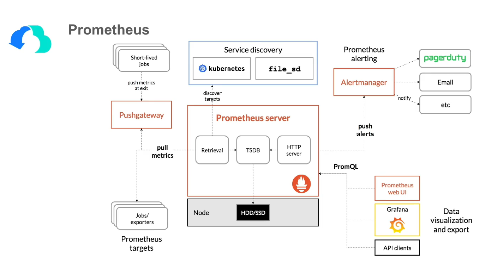

# APP

这里实现各个微服务的主要业务逻辑

## 服务注册与发现Consul

+ 安装

  + 首先转到待实现的微服务模块，然后控制台输入：

      ```powershell
      go get github.com/kitex-contrib/registry-consul
      ```

+ 使用说明：

  ```go
  // main.go
  ...
  func kitexInit() (opts []server.Option) {
  	...
  	// service info
  	opts = append(opts, server.WithServerBasicInfo(&rpcinfo.EndpointBasicInfo{
  		ServiceName: conf.GetConf().Kitex.Service,
  	}))
      
  	/** 
  		在这里把服务注册到 Consul
      	 - 初始化 Consul 注册中心，conf.GetConf().Registry.RegistryAddress[0] 提供了 Consul 的地址。
  		 - 在自己机器上运行时，注册器的配置文件在 /conf/test/conf.yaml
  		 - registry_address端口设置为8500
      */
  	r, err := consul.NewConsulRegister(conf.GetConf().Registry.RegistryAddress[0])
  	if err != nil {
  		log.Fatal(err)
  	}
  	opts = append(opts, server.WithRegistry(r))
  
  	// klog
  	logger := kitexlogrus.NewLogger()
      ...
  }
  
  ```

  

## 监控指标Prometheus



Prometheus 大概的工作流程：

1. Prometheus server 定期从配置好的 jobs 或者 exporters 中拉（pull模式）  metrics，或者接收来自 Pushgateway 发过来（push模式）的 metrics，或者从其他的 Prometheus server 中拉 metrics；
2. Prometheus server 在本地存储收集到的 metrics，并运行已定义好的 `alert.rules`，记录新的时间序列或者向 Alertmanager 推送警报；
3. Alertmanager 根据配置文件，对接收到的警报进行处理，发出告警；
4. 在图形界面中，可视化采集数据，例如对接Grafana。

### 数据模型

Prometheus 中存储的数据为时间序列，是由 metric 的名字和一系列的标签（键值对）唯一标识的，不同的标签则代表不同的时间序列。

- name：一般用于表示 metric 的功能；注意，metric 名字由 ASCII 字符，数字，下划线，以及冒号组成，必须满足正则表达式 [a-zA-Z_:][a-zA-Z0-9_:]*；
- tag：标识了特征维度，便于过滤和聚合。例如 PSM 和 method 等信息。tag 中的 key 由 ASCII 字符，数字，以及下划线组成，必须满足正则表达式 [a-zA-Z_:][a-zA-Z0-9_:]*；
- sample：实际的时间序列，每个序列包括一个 float64 的值和一个毫秒级的时间戳；
- metric：通过如下格式表示：{=, ...}

### Metric类型

#### Counter 

- 可以理解为只增不减的计数器，典型的应用如：请求的个数，结束的任务数， 出现的错误数等等；
- 对应 gopkg/metrics 的 `EmitCounter`。

#### Gauge

- 一种常规的 metric，典型的应用如：goroutines 的数量；
- 可以任意加减；
- 对应 gopkg/metrics 的 `EmitStore`。

#### Histogram

- 生成直方图数据，用于统计和分析样本的分布情况，典型的应用如：pct99，CPU 的平均使用率等；
- 可以对观察结果采样，分组及统计。
- 对应 gopkg/metrics 的 EmitTimer。

#### Summary

- 类似于 Histogram，提供观测值的 count 和 sum 功能；
- 提供百分位的功能，即可以按百分比划分跟踪结果；
- Summary 的分位数是直接在客户端计算完成，因此对于分位数的计算而言，Summary 在通过 PromQL 进行查询时有更好的性能表现，而 Histogram 则会消耗更多的资源，对于客户端而言 Histogram 消耗的资源更少。